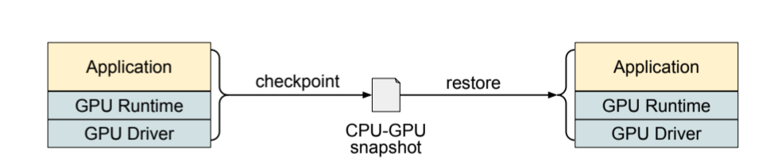

# Checkpoint/Restore with CRIUDA
Efficient checkpointing of AI workloads is a crucial task to ensure the reliability, reproducibility, and fault tolerance of large-scale training processes. This involves storing the internal state of both GPU and CPU processes as a collection of files, which can later be used to restore the exact process state.
The checkpoint mechanism can be implemented at different levels of the software stack: application-level (not transparent), library-level (semi-transparent), and system-level (fully transparent). System level checkpointing does not require any assumption on the tasks to checkpoint, offering a more general and trasparent approach compared to the other solutions. 

A fully transparent and efficient checkpointing solution is offered by the checkpoint/restore tool CRIU (Checkpoint/Restore In Userspace) starting from version 4.0. In particular, CRIU combines GPU and CPU state in a single unified snapshot, eliminating performance overheads typical of state-of-the-art transparent checkpointing mechanism.

<div align="center">
  
  <p><em>Figure 1: CRIUDA checkpointing system. Adapted from <a href="https://arxiv.org/abs/2502.16631">Stoyanov et al., 2024</a>.</em></p>
</div>

> [!IMPORTANT]
> To download some of the libraries required for installing CRIU and to effectively use the tool, root privileges are required.

## How to install
Follow the steps below to install and use CRIU:

1. Install CRIU from [CRIU Installation](https://criu.org/Installation)
2. Clone this repository
3. Modify variable [CRIU_EX](https://github.com/fablnt/CRIUDA-Checkpoint/blob/master/checkpoint.sh#L11C1-L11C11) in ```checkpoint.sh``` inserting the path to the criu executable located in the /criu/criu/ directory (e.g. CRIU_EX="/home/mpcheckpoint/criu/criu/").
4. Modify variable [DIR](https://github.com/fablnt/CRIUDA-Checkpoint/blob/master/bashrc#L1) in the ```bashrc``` and in the ```checkpoint.sh``` file inserting the path to the CRIU directory (e.g. DIR=/home/mpcheckpoint).
5. TODO cuda plugin.

## Usage
The `checkpoint.sh` script handles the execution of checkpoint and restore operations with CRIU in a simplified manner. Before executing any of the below commands, source the `bashrc` file with

```
source bashrc
```

### Starting a program
To run a program

```
start <additional arguments> file_name.py <python arguments>
```
where the additional arguments can be:
- ```-id``` : tag to identify different process executing the same python file.
- ```-time```: specify time in seconds after which the program will stop and checkpoint its state.
- ```-periodic```: specify time in seconds after which the program will checkpoint its state peridiocally, continuing its execution.

If not present, the output directory will be created, containing for each process an output_fileName_id.log file that logs the output stream.

If not present, the checkpoints directory will be created, containing for each process a checkpoint_fileName_id directory containing the checkpoint snapshots.


### Checkpointing a program
To checkpoint a program 

```
stop -id <id> file_name.py 
```
```-id``` must be included if previously specified in the start command.


### Resuming a program
To resume a checkpointed program

```
resume -id <id> file_name.py 
```
```-id``` must be included if previously specified in the start command. Additionally, the ```-periodic``` and the ```-time``` can be used equivalently as in the start command.


> [!NOTE]
> Be sure to be in the same directory where the checkpoint and output diretories are when resuming a program.
